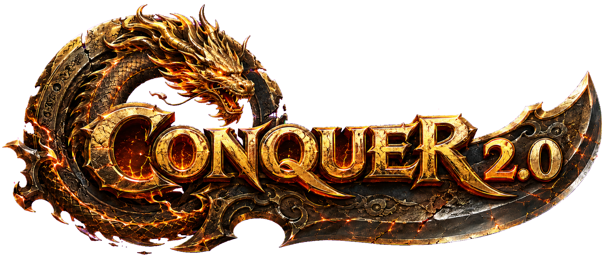

<p align="center">
  <a href="https://conquer.dek.cx"></a>
</p>

<h1 align="center">Preservation CO Client</h1>

<p align="center">An offline Conquer Online skeleton client. Written in Rust.</p>

<p align="center">
  <a href="https://github.com/deklol/Preservation-CO-Client/releases/latest"></a>
  
  
  
  <a href="#credit"></a>
</p>

<p align="center">
  <a href="https://discord.gg/CvKPXEHYRY">Discord</a> ·
  <a href="https://conquer.dek.cx">Preservation Conquer</a> ·
  <a href="https://dek.cx">dek.cx</a> ·
  <a href="https://x.com/digitalm1nd">@digitalm1nd</a> ·
  <a href="https://github.com/deklol">GitHub</a>
</p>

## What's here

This is a small part of my Preservation Conquer client, shared for people who want to learn or build their own. It loads an empty Twin City locally as `dek`.

- Map and character rendering, equipment, shadows and nameplates
- Walking, running, jumping and collision
- Original minimap with a player marker, zoom and expand controls
- Readers for the original client files

**This is the skeleton, not the full client.** There is no server connection, combat, skill system, effects or game windows. Game assets are not included.

Want to play the full client? **[Try it on the Preservation CO server](https://conquer.dek.cx).**

## Build and run

You need a **Conquer Online 5065 installation**, Rust 1.95 or newer, and Visual Studio C++ Build Tools with the Windows SDK. Tested on Windows x64.

[Download the 5065 client files](https://mega.nz/#!lVwQyJBZ!mIe5uRJu0SZGJQloky0l0kfbxRkT8UmrzYU7Z4Rb7Hg), then extract them.

```sh
git clone https://github.com/deklol/Preservation-CO-Client.git
cd Preservation-CO-Client
cargo run --release --locked -- --assets "<your-5065-folder>"
```

Point `--assets` at the folder containing `ini`, `map`, `data.wdf` and `c3.wdf`. It does not need to be in a particular location.

## Controls

| Input | Action |
| --- | --- |
| Left click or hold | Move |
| Ctrl + click or hold | Jump |
| `/` | Toggle run/walk |
| Shift + click | Turn |
| Space | Stop after the current step or jump |
| Escape | Exit |
| Minimap buttons | Toggle crop/full-map view and expand/collapse |

Edit `character.ini` and rebuild to change the local character. Use `--help` for launch options. Layered PUX maps are not supported.

## Developers and preservationists

Working on a Conquer client, researching the old game, or interested in helping preserve it? **[Join the Discord](https://discord.gg/CvKPXEHYRY).**

I share more detailed explanations, source snippets and progress there. You can also get involved in beta testing the full Preservation Conquer client. Find me as **_dek**.

## Credit

By [@digitalm1nd](https://x.com/digitalm1nd) / **_dek** on Discord, for Preservation Conquer.

**If you use this code, including modified versions, credit @digitalm1nd / _dek and Preservation Conquer.** Keep the source headers and include the [Discord link](https://discord.gg/CvKPXEHYRY) in your README or credits. Don't pass it off as entirely your own work.

## Tests

```sh
cargo test --workspace --locked
cargo run --release --locked -- --assets "<your-5065-folder>" --check-assets
```

Run `./tools/package-source.ps1` to create a source ZIP in `dist/`. No game assets or build files are packaged.
